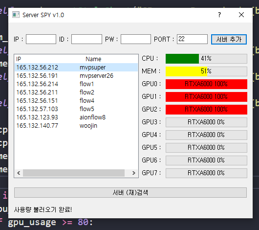

# Server-SPY

등록된 서버의 CPU, 메모리, GPU등의 상태를 모니터링하는 프로그램입니다.

## 사용방법
* [여기](https://github.com/Hydragon516/Server-SPY/releases)에서 최신 파일을 다운받습니다.
* 압축을 해제하고 server-spy.exe를 실행합니다.
* 연결할 서버의 아이디, 패스워드, IP 등을 입력하여 등록합니다.
* 서버 연결 버튼을 눌러 서버를 모니터링합니다.

